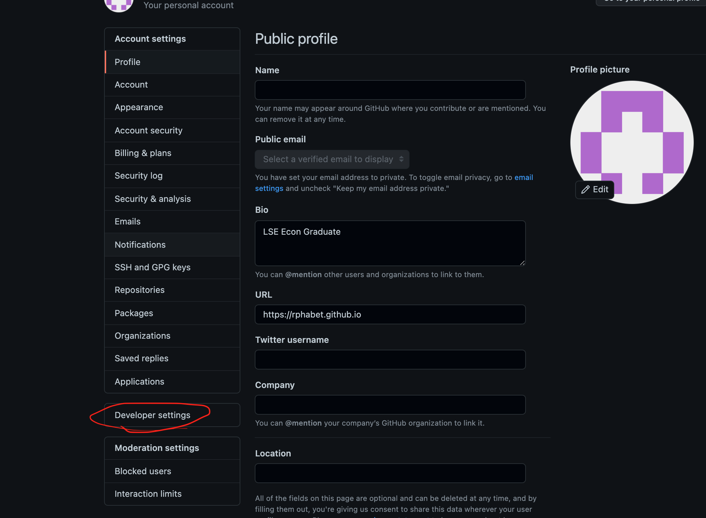
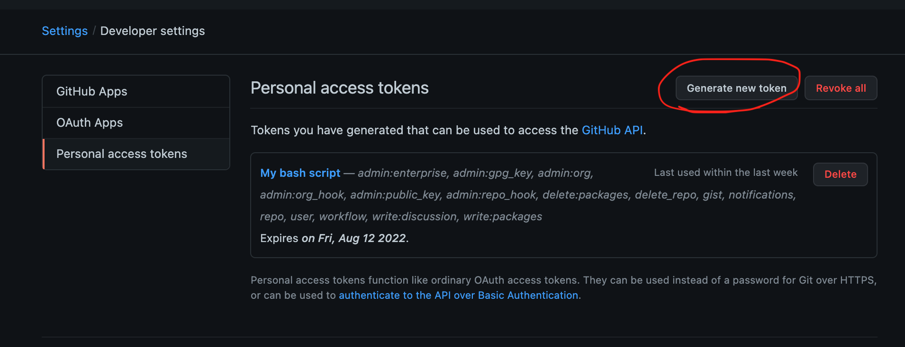

# git error 403 해결 방법

---

안녕하세요. 

깃린이 빅벤입니다.

음... 어제는 블로그 포스팅을 깃에 푸쉬하다가 굉장히 낯선 에러를 보았는데요.

```bash
Bans-MacBook-Pro:Rphabet.github.io bangirimben$ git push

remote: Support for password authentication was removed on August 13, 2021. Please use a personal access token instead.
remote: Please see https://github.blog/2020-12-15-token-authentication-requirements-for-git-operations/ for more information.
fatal: unable to access 'https://github.com/Rphabet/Rphabet.github.io.git/': The requested URL returned error: 403
```

대충 뭐.. 2021년 8월 13일부터 패스워드를 통한 인증 방식이 아닌 `토큰` 방식으로 바뀌었다고 하네요. 네 그래서 본인 인증 실패(?)가 403 에러를 야기한거 같아요.

거두절미 하고 해결 방법에 대해 알아보죠.

1.  깃헙 페이지에서 우상단에 있는 프로필을 눌러 `Settings` 로 들어갑시다.

2. 그리고 Devloper settings 를 클릭하게 되면

3. 이런 화면에 들어오게 됩니다. 세번째 탭인 `Personal access tokens` 를 눌러줍시다.

4. 그러면 우측 상단에 `Generate new token` 버튼이 있는걸 볼 수 있는데 그대로 눌러주시면 됩니다. (저는 이미 생성했기에 Revoke all 버튼이 생성되어 있어 다를 수 있습니다.)

   그리고 토큰을 처음 받게되면 토큰 일련번호를 받을 수 있으실텐데요. 정말 중요한 키니깐 꼭 어딘가에 기록해두길 바랍니다. 

5. 자 이제 아래와 같이 `bash` 를 통해 url을 다시 설정해주시면 됩니다.     

   `git remote set-url origin https://<nick name>@github.com/<nickname>/<repository name>`

   아래 예제로 제가 실행시킨 명령어는 블로그 레포지토리 이름이에요ㅎㅎ

6. 완료가 되셨다면 `git remote -v` 명령어를 통해 주소를 확인하고, add, commit, push 를 통해 원하시는 파일을 레포지토리에 올리면 됩니다.

```bash
(base) Bans-MacBook-Pro:Rphabet.github.io bangirimben$ git remote set-url origin https://rphabet@github.com/rphabet/rphabet.github.io.git


(base) Bans-MacBook-Pro:Rphabet.github.io bangirimben$ git remote -v

origin	https://rphabet@github.com/rphabet/rphabet.github.io.git (fetch)
origin	https://rphabet@github.com/rphabet/rphabet.github.io.git (push)


(base) Bans-MacBook-Pro:Rphabet.github.io bangirimben$ git push

Password for 'https://rphabet@github.com': 
Enumerating objects: 6, done.
Counting objects: 100% (6/6), done.
Delta compression using up to 8 threads
Compressing objects: 100% (4/4), done.
Writing objects: 100% (4/4), 3.80 KiB | 3.80 MiB/s, done.
Total 4 (delta 2), reused 0 (delta 0), pack-reused 0
remote: Resolving deltas: 100% (2/2), completed with 2 local objects.
remote: This repository moved. Please use the new location:
remote:   https://github.com/Rphabet/Rphabet.github.io.git
To https://github.com/rphabet/rphabet.github.io.git
   fa61075..5ddf2c9  master -> master

```

7. url을 재설정하고 최초 푸쉬를 하게 될 경우 패스워드를 입력하라고 합니다. 그때 아까 저장해두었던 토큰번호를 복붙한다면 해결하실 수 있습니다.


이상 깃린이였습니다. 👋 